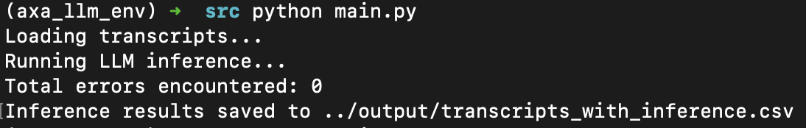

# LLM to understand customer sentiment, follow-up action and topic tag

# Tech Stack used:
* Python and various supporting

# [LLM Used](https://huggingface.co/mistralai/Mistral-Nemo-Instruct-2407)

# Goal
Use a large language model of my choice to analyse the customer side of phone transcripts:

1. Identify the sentiment (positive, negative, neutral) of the call
2. Determine call outcome (issue resolved, follow-up action needed)
3. Use appropriate metrics to monitor the performance of the model.
4. Use methods of my choice (exploratory data analysis, statistical methods, visualisations etc.)  to extract useful insights from the data.

# Methodology
* Process text to be used for LLM inference
* Run inference
* Establish "base truth" dataset to create an accuracy metric. I decided 20% of entire dataset was sufficient to establish a baseline accuracy score.
* Once happy with score, I run EDA within jupyter notebooks to extract insights
* Package code and related files, create pytest unitests to check functions are correct as well as to monitor model performance if it falls below established threshold.
* Create CI to automate tests, linting etc.

# To run:
* `git clone https://github.com/cmaxk/cs_sentiment.git`
* `cd cs_sentiment`
* `pyenv virtualenv 3.10.6 cs_sentiment_env`
* `pyenv activate cs_sentiment_env`
* `pip install --upgrade pip`
* `pip install -r requirements.txt`
* You will also need to create a .env file containing a HugginFace Token:
* `touch .env`
* `echo 'HF_TOKEN="your_hugging_face_token_here"' >> .env`
* `python src/main.py`

You should then see the following output:

If you encountered an error during pre-processing of text:

You can also run the tests by running `pytest tests/` from the root directory:

# Notebook containing EDA and insights can be found [here](https://github.com/CMaxK/cs_sentiment/blob/main/notebooks/inference_prep.ipynb)
